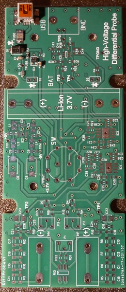
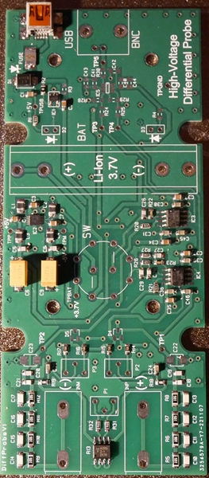

# High-Voltage Differential Probe (DIY)

DIY High-Voltage Differential Probe designed for safe measurement of floating and high-potential signals using a standard oscilloscope.

This project provides a battery-powered, fully isolated differential probe suitable for SMPS debugging, half/full-bridge analysis, and high-side measurements.

### Author

[DIY project by Andrew Levido](https://circuitcellar.com/research-design-hub/high-voltage-differential-probe/)

### Modification

[Modification project by Andrzej Szupiluk]

## ⚙️ Project Overview

Standard oscilloscope probes reference ground, which makes measuring floating or high-side signals dangerous or impossible.

This differential probe solves that problem by:

- Providing true differential input (IN+ / IN−)
- Using a precision resistor divider network
- Amplifying the differential signal
- Running from isolated battery supply (Li-Ion 3.7 V)
- Outputting through BNC connector

---

## 📊 Measured Frequency Response

Measurement performed using Digilent Discovery 3.

**Sweep parameters:**
- Start: 1 Hz  
- Stop: 10 MHz  
- 101 points  
- Logarithmic scale  

**Observed behavior:**
- Nominal gain ≈ -20 dB  
- Flat response up to ~100 kHz  
- Gradual roll-off in MHz range  
- Increasing phase shift above ~1 MHz  

---

## 📷 Gallery

### PCB – Bare Board

### Assembly Progress

### Final Assembly

---

## 🏗 Architecture

### Input Stage
- Differential IN+ / IN− terminals
- High-voltage resistor divider
- Input protection diodes
- RC compensation network

### Amplifier Stage
- Differential operational amplifier
- Precision matched resistors
- Frequency compensation network

### Power Supply
- Li-Ion 3.7 V battery
- DC/DC converter generating ±5 V
- USB charging circuit
- Input fuse protection

### Output
- BNC connector
- Test ground (TPGND)

---

## 📐 Technical Parameters (Prototype)

| Parameter | Value |
|------------|--------|
| Gain | ≈ -20 dB |
| Flat Bandwidth | ~100 kHz |
| Estimated -3 dB Bandwidth | ~ MHz range |
| Power Supply | Li-Ion 3.7 V |
| Output | BNC |
| Input Type | Differential |

*(Final values may vary depending on component selection and calibration.)*

---

## 🔋 Power System

- Powered from single Li-Ion 3.7 V cell
- On-board DC/DC generates symmetrical supply
- USB charging capability
- Isolated from measured circuit

---

## 🧪 Test Conditions

The probe was tested for:

- Frequency response (Bode plot)
- Gain stability
- Phase response
- General stability under differential input conditions

## 📌 Build Status

✔ Probe assembled  
✔ Frequency response measured  
⬜ Bandwidth optimization  
⬜ Enclosure design  
⬜ Extended validation  

### Author

DIY project by @jurekms

